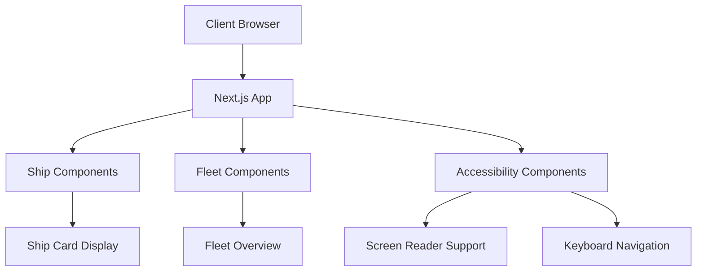
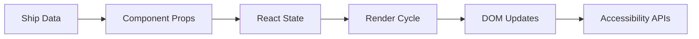

# Architecture Diagrams

## System Overview



## Component Hierarchy

```mermaid
tree
root: "Star Fleet Dashboard"
  root: "Components"
    Components: "Ship Card"
      ShipCard: "AccessibleShipCard"
      ShipCard: "OptimizedShipStats"
    Components: "Fleet Overview"
      FleetOverview: "OptimizedFleetOverview"
      FleetOverview: "Critical Ships Alert"
      FleetOverview: "Sorted Ships Display"
    Components: "Accessibility"
      Accessibility: "AccessibleNavigation"
      Accessibility: "ScreenReaderAnnouncer"
      Accessibility: "FocusManager"
```

## Data Flow


