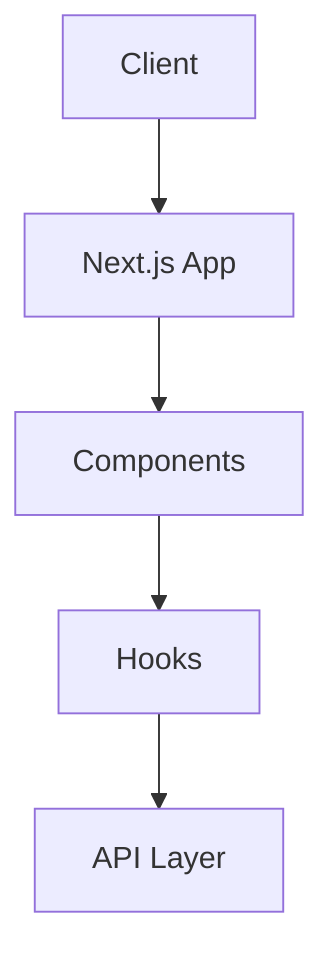
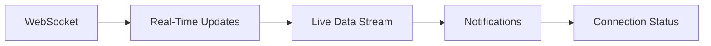

# Architecture Diagrams for Starfleet Fleet Monitoring Dashboard

## System Components

### Frontend Architecture

```mermaid
graph TD
    A[Client] --> B[Next.js App]
    B --> C[Components]
    C --> D[Hooks]
    D --> E[API Layer]
```

### Data Flow

```mermaid
graph LR
    A[WebSocket] --> B[Real-Time Updates]
    B --> C[Live Data Stream]
    C --> D[Notifications]
    D --> E[Connection Status]
```
